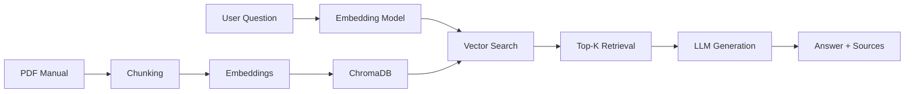

## 🎲 Board Game Q&A Chatbot (CATAN) - RAG System with GPT-3.5 Turbo

> **A Retrieval-Augmented Generation (RAG) system that answers questions about the board game "CATAN" manuals with 85%+ faithfulness and comprehensive evaluation metrics.**

### ⚡ **TL;DR**

**Description:** AI chatbot that answers questions about the rules of the board game "CATAN"  <br>
**Tech:** OpenAI GPT-3.5 Turbo + LangChain + ChromaDB + Streamlit  <br>
**Key Results:** XX.X% faithfulness score | XX.X% retrieval accuracy (nDCG)  TBD<br>
**Online Demo:** [https://broadgame-question-and-answer.streamlit.app/](https://broadgame-question-and-answer.streamlit.app/)  <br>
**Content:** Full RAG pipeline with retrieval and generation evaluation<br>

---

### 🚀 **Online Demo → [Link](https://broadgame-question-and-answer.streamlit.app/)** (support computer and mobile usage)


---

### 📊 **Performance Results**

#### **Retrieval Evaluation**
> 📈 **With a dataset of 10 questions, here are the result charts of retrieval evaluation:**


| Metric | Description | Scale |
|--------|----------------|-----|
| **Average NDCG(Normalized Discounted Cumulative Gain)** | Measures how well the retrieved chunks are ranked compared to an ideal. | 0 - 1 scale
| **MRR(Mean Reciprocal Rank)** | Captures how early the first relevant chunk appears in the ranking, with higher values meaning earlier retrieval. | 0 - 1 scale |
| **Overall MRS(Mean Retrieval Similarity)** | Indicates the proportion of queries where at least one relevant chunk appears within the top-k results. | 0 - 1 scale |
| **Mean HitRate@K** | Represents the average similarity score of the top-k retrieved chunks across all queries. | 0 - 1 scale |

Summary metrics are calculated as follows:
| Summary Metric | Equation |
|--------|----------------|
| **Average** | 0.2 x Average NDCG + 0.2 x MRR + 0.2 x Overall MRS + 0.2 x Mean HitRate@K |
| **Ranking Prioritize** | 0.4 x Average NDCG + 0.4 x MRR + 0.1 x Overall MRS + 0.1 x Mean HitRate@K |

Best combination with a dataset of 10 questions
| Summary Metric | Chunk Size | Chunk Overlap | Top k | Scores |
|--------|----------------|-----|-----|----|
| **Average** | 125 | 120 | 5 | 0.7874 |
| **Ranking Prioritize** | 125 | 120 | 5 | 0.7647 |
 
#### **Generation Evaluation (RAGAS)**

| Metric | Description | Scale |
|--------|-------|------------------|
| **Faithfulness** | Assesses whether the answer is consistent with the retrieved context, without hallucination. |  |
| **Answer Relevancy** | Captures how relevant the generated answer is to the user’s question. |  |
| **Answer Correctness** | Measures whether the model’s answer is factually correct based on the reference. |  |
| **Context Precision** | Fraction of retrieved chunks that are actually relevant to the question. |  |
| **Context Recall** | Fraction of all relevant chunks that were successfully retrieved. |  |

---

## 🛠️ **Technology Stack**

<table>
<tr>
<td width="50%">

**🤖 LLM & Embeddings**
- OpenAI GPT-3.5 turbo (generation)
- text-embedding-ada-002 (embeddings)
- LangChain framework

</td>
<td width="50%">

**💾 Vector Database**
- ChromaDB (Vector Store)
- Cosine similarity search

</td>
</tr>
<tr>
<td>

**📊 Evaluation**
- RAGAS (Generation Metrics)
- DCG/nDCG/MRR/Mean MRS/Mean HitRate@K (Retrieval Metrics)

</td>
<td>

**🎨 Interface**
- Streamlit (web app & Mobile)

</td>
</tr>
</table>

**Other Libraries**: PyPDF2, sentence-transformers, python-dotenv, pandas

---

## 📁 **Project Structure**

```
rag-board-game-qa/
├─── demo.py                       # Demo
├── 📱 app/
│   ├── streamlit_app.py           # Web interface
├── 💻 src/
│   ├── __init__.py                # Version control
│   ├── rag_system.py              # Core RAG pipeline
│   ├── document_loader.py         # PDF processing
│   ├── chunking.py                # Text chunking strategies
│   ├── vector_store.py            # ChromaDB operations
│   ├── annotation.py              # Ground truth annotation
│   ├── exception.py               # Exception management
│   ├── prompts.py                 # Prompts templates management
│   └── config.py                  # Configuration management
├── 🔬 evaluation/
│   ├── __init__.py                # Version control
│   ├── evaluation.py              # Evaluation pipeline
│   ├── metrics.py                 # DCG/nDCG implementation
│   ├── run_evaluation.py          # Evaluation runner
│   └── results_csv/               # CSV outputs
├── 📊 data/
│   └── BoardGamesRuleBook/        # Game manuals & test data
└── 📓 notebooks/
    └── rag_experiments.ipynb      # Analysis & visualization
```

---

## 🚀 **Quick Start**

### **1. Try the Live Demo**
Visit **[https://rag-board-game.streamlit.app/](https://rag-board-game.streamlit.app/)** - no setup required!

### **2. Run Locally**

```bash
# Clone the repository
git clone https://github.com/khchu93/Do-my-history-exam.git
cd Do-my-history-exam

# Create virtual environment
python -m venv venv
source venv/bin/activate  # Windows: venv\Scripts\activate

# Install dependencies
pip install -r requirements.txt

# Set up environment variables
echo "OPENAI_API_KEY=your_key_here" > .env

# Run Streamlit app
streamlit run app/streamlit_app.py

# OR run CLI demo
python app/demo.py
```

---

## 🔍 **How It Works**



### **Pipeline Overview**

1. **Document Processing**: PDF manuals chunked into 300-token segments with 30-token overlap
2. **Embedding**: Chunks embedded using OpenAI's `text-embedding-3-small`
3. **Storage**: Vectors stored in ChromaDB with metadata
4. **Retrieval**: User query embedded → cosine similarity search → top-5 chunks
5. **Generation**: GPT-4o-mini synthesizes answer from retrieved context
6. **Evaluation**: RAGAS metrics validate quality

---

## 🧪 **Run Your Own Evaluation**

```bash
# Run full evaluation pipeline
python evaluation/run_evaluation.py

# Results saved to:
# - evaluation/results/retrieval_eval.csv
# - evaluation/results/generation_eval.csv
```

This will:
- Test different chunking strategies (100-500 tokens)
- Evaluate retrieval quality (DCG/nDCG)
- Measure generation quality (RAGAS)
- Export results for analysis

---

## 🔧 **Configuration**

Key parameters in `src/config.py`:

```python
# Model Configuration
EMBEDDING_MODEL = "text-embedding-3-small"
LLM_MODEL = "gpt-4o-mini"

# Chunking Strategy
CHUNK_SIZE = 300          # Optimal for balance
CHUNK_OVERLAP = 30        # 10% overlap

# Retrieval Parameters
TOP_K = 5                 # Number of chunks to retrieve
```

Customize these based on your use case!

---

## 📚 **What I Learned**

### **Technical Skills**
- Designing and implementing production RAG systems
- Comprehensive evaluation (beyond just "does it work?")
- Balancing precision vs. recall in retrieval
- Optimizing chunk size and overlap strategies
- Prompt engineering for consistent LLM outputs

### **Software Engineering**
- Modular architecture for maintainability
- Proper error handling and logging
- Configuration management best practices
- Git workflow and documentation

### **Evaluation & Metrics**
- Coverage-based relevance scoring
- Position-aware ranking (DCG/nDCG)
- Multi-dimensional generation quality (RAGAS)
- Ground truth annotation strategies

---

## 🚀 **Future Enhancements**

- [ ] Support for multiple board games (multi-document retrieval)
- [ ] Hybrid search (dense + sparse embeddings)
- [ ] Image support (diagrams from manuals)
- [ ] Multi-language support
- [ ] Query expansion and reformulation
- [ ] Fine-tuned embeddings for domain adaptation
- [ ] User feedback loop for continuous improvement

---

## 🙏 **Acknowledgments**

- **OpenAI** for GPT and embedding models
- **LangChain** for RAG framework
- **RAGAS** for evaluation metrics
- **Streamlit** for rapid prototyping

---

## 📧 **Contact**

Have questions or want to collaborate? Reach out!

- **GitHub**: [@khchu93](https://github.com/khchu93)
- **Project**: [github.com/khchu93/Do-my-history-exam](https://github.com/khchu93/Do-my-history-exam)
- **Live Demo**: [rag-board-game.streamlit.app](https://rag-board-game.streamlit.app/)
